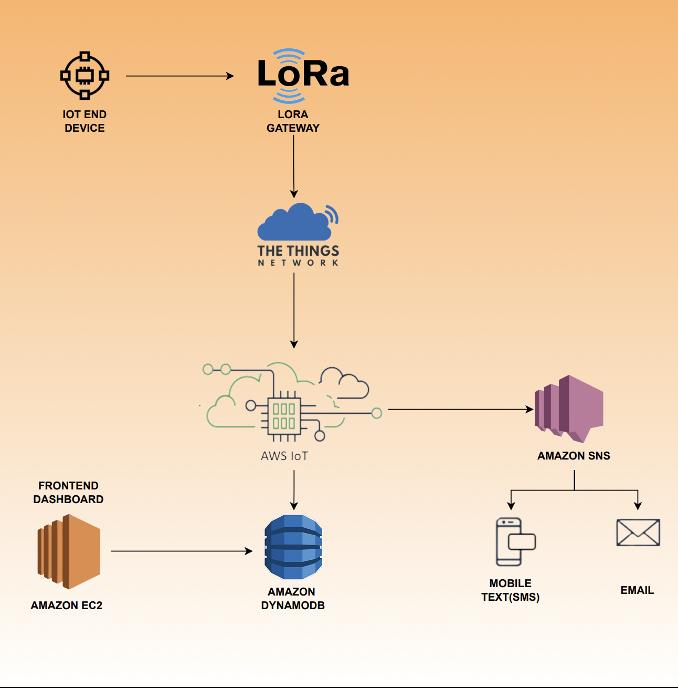

# Step-by-step guide for IoT-AWS integration
## 1. Connect Gateway device to TTN
1. Create an account on The Things Network to start using The Things Stack Community Edition: https://console.cloud.thethings.network/
2. Add Gateway in The Things Stack using console: https://www.thethingsindustries.com/docs/gateways/adding-gateways/
3. Connect The Things Indoor Gateway device to The Things Stack: https://www.thethingsindustries.com/docs/gateways/thethingsindoorgateway/
    > Note: This step also includes connecting Gateway device to WiFi

## 2. Connect LoRa end device (RAK board with mic) to Gateway
1. Add application using the TTN console: https://www.thethingsindustries.com/docs/integrations/adding-applications/
2. Connect RAK Wireless WisBlock to The Things Stack: https://help.ubidots.com/en/articles/4826310-connect-rak-wireless-wisblock-to-the-things-stack-and-ubidots#:~:text=Device%20provision%20in%20TTS

    > Refer [documentation](https://www.thethingsindustries.com/docs/devices/adding-devices/) for  more details

## 3. Connect TTN to AWS IoT
1. Deploy AWS IoT integration for The Things Stack: https://www.thethingsindustries.com/docs/integrations/cloud-integrations/aws-iot/default/deployment-guide/
2. Store IoT device data in DynamoDB table: https://docs.aws.amazon.com/iot/latest/developerguide/iot-ddb-rule.html
3. Send Amazon SNS notification: https://docs.aws.amazon.com/iot/latest/developerguide/iot-sns-rule.html

# Add LoRa end device to DynamoDB table
1. Navigate to https://gunshot.signin.aws.amazon.com/console and login with the respective IAM user credentials.
2. Search for DynamoDB and navigate to its respective dashboard.
3. Click on `tables` in the left hand menu and search for the table `device_locations` and click on it.
4. Click on `view items` in the table dashboard.
5. Click on `create item` and select `JSON`.
6. Add the corresponding device id and coordinate of the device as shown below.
```
    {
      "id": {
        "N": "0" (Increment the ID by 1 for every device you add)
      },
      "device_details": {
        "M": {
          "device_id": {
            "S": "AC1F09FFFE05705E" (Replace this string with the corresponding device ID)
          },
          "coordinates": {
            "S": "33.409872,-111.9226166" (Add coordinates in the format latitude,longitude)
          }
        }
      }
    }
```
7. Click on `create item`.

# Architecture Diagram



